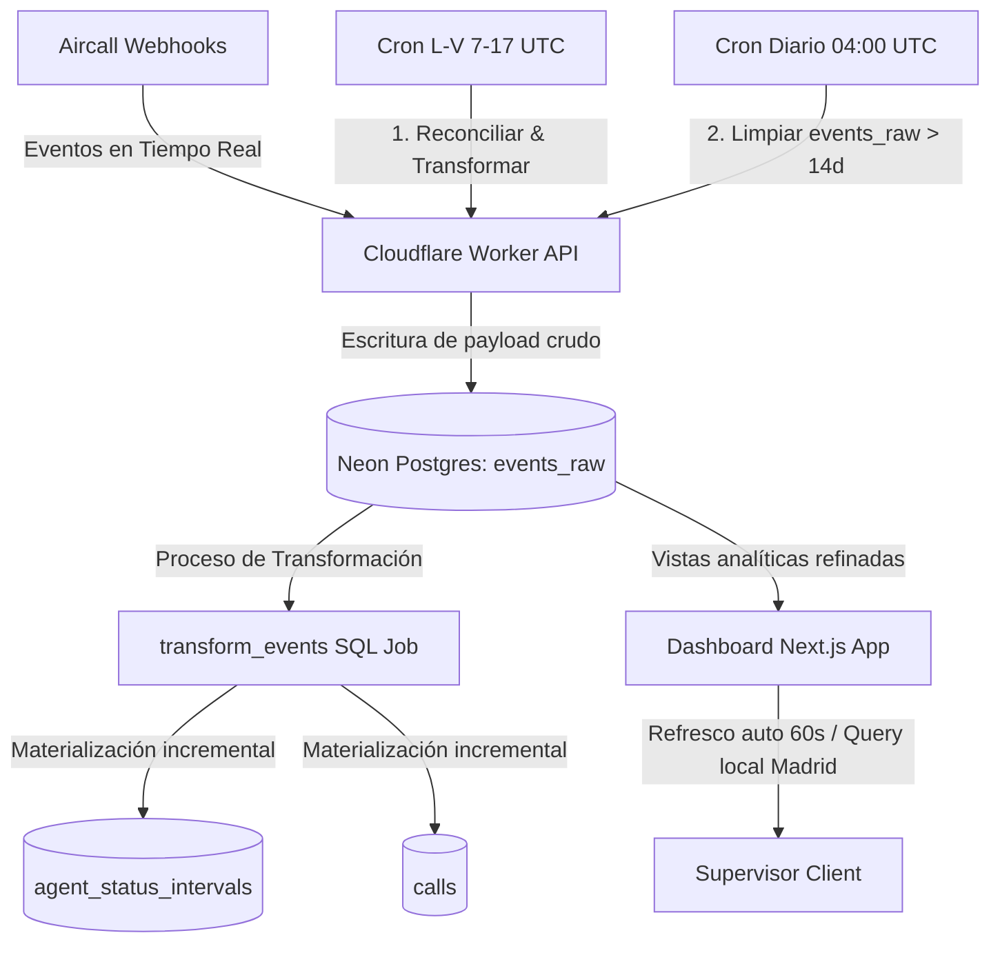

# 📞 Aircall KPIs & Agent Analytics Dashboard

[](https://nextjs.org/)
[](https://workers.cloudflare.com/)
[](https://neon.tech/)
[](https://www.typescriptlang.org/)

Un dashboard analítico y de monitoreo en tiempo real diseñado como una alternativa personalizada y de bajo costo a **Aircall Analytics+ / Monitoring+**. Captura eventos de webhooks de Aircall en tiempo real, los procesa incrementalmente, ejecuta ciclos de reconciliación periódicos y visualiza de forma segura el rendimiento de agentes, pausas y llamadas operativas.

---

## 🏗️ Arquitectura del Sistema



El sistema opera con tres procesos automáticos clave diseñados para garantizar la consistencia de los datos y optimizar el consumo de recursos de la base de datos (manteniendo el proyecto dentro del **Free Tier** de Neon):

1. **Ingesta en Tiempo Real**: Los webhooks de Aircall envían eventos `user.*` y `call.*` que el Worker procesa criptográficamente al instante y almacena de forma inmutable en `events_raw`.
2. **Reconciliación y Transformación Laboral (`*/10 7-17 * * 1-5`)**: Un Cron Trigger que se ejecuta cada 10 minutos exclusivamente de **Lunes a Viernes de 07:00 a 17:00 UTC** (cubriendo la jornada de 09:00 a 18:00 de Madrid) consulta la API pública de Aircall para alinear posibles desvíos y corre el job `transform_events()` para materializar intervalos de presencia y llamadas. Esto permite que la base de datos Neon hiberne automáticamente fuera de horario laboral, reduciendo el consumo de cómputo en un ~70%.
3. **Limpieza Automática y Retención (`0 4 * * *`)**: Un Cron Trigger diario a las 04:00 UTC elimina todos los registros crudos de `events_raw` que tengan más de **14 días**. Dado que los reportes de rendimiento y pausas se leen de las tablas derivadas (`agent_status_intervals` y `calls`), esta limpieza previene que el almacenamiento de la base de datos supere el límite gratuito de 0.5 GB.

---

## 📂 Estructura del Repositorio

El proyecto está organizado en módulos desacoplados y configuraciones versionadas:

* **`/dashboard`**: Aplicación Next.js 16 (App Router, React 19) con estilos en TailwindCSS y componentes dinámicos de visualización. Conexión segura Neon server-side.
* **`/worker`**: Cloudflare Worker en TypeScript encargado de procesar la firma criptográfica de los webhooks, almacenar los payloads y reconciliar estados vía cron.
* **`/migrations`**: Archivos de migración SQL (`001` a `005`) para levantar la base de datos Neon Postgres, crear índices de rendimiento, triggers automáticos y helpers de zona horaria.
* **`/queries`**: Repositorio de consultas analíticas y de auditoría de referencia.
* **`/scripts`**: Utilidades y scripts para pruebas o análisis rápido de base de datos.

---

## 🗄️ Modelo de Datos y Helpers SQL

El motor analítico se apoya en Neon Postgres y consume vistas optimizadas de negocio para aislar la lógica de filtros y zonas horarias:

### Tablas Principales
* **`events_raw`**: Repositorio inmutable y auditable de todos los payloads JSONB enviados por Aircall.
* **`agent_status_intervals`**: Intervalos de presencia del agente.
* **`calls`**: Registro de llamadas con metadatos y categorización de motivos de pérdida.

### Vistas de Negocio (`migrations/004_create_views.sql`)
* **`v_users`**: Vista de usuarios activos, excluyendo cuentas administrativas o de equipo compartido (como `Preventa Team`).
* **`v_perdidas_reales`**: Aísla llamadas que representan pérdidas operativas verdaderas (descartando abandonos rápidos o fuera de horario).
* **`v_pausas_operativas`**: Filtra pausas y las recorta a la jornada laboral, excluyendo comidas y periodos superiores a 40 minutos.
* **`v_pausas_anomalias`**: Lista intervalos largos de pausas (>40 min) clasificados para auditoría operativa.

### Helpers de Tiempo de Madrid (`migrations/005_madrid_time_helpers.sql`)
* `madrid_local(ts)`: Devuelve el timestamp ajustado al huso de Madrid (útil para cast ::date o ::time).
* `madrid_day_start(ts)` / `madrid_day_end(ts)`: Delimita el inicio y fin seguro del día en horario local.
* `madrid_work_start(ts)` / `madrid_work_end(ts)`: Establece la ventana laboral de 09:00 a 18:00 hora local.

---

## 🔔 Eventos de Aircall Suscritos

El sistema escucha activamente los siguientes eventos:

* **Presencia y Timeline**: `user.connected.v2`, `user.disconnected.v2`, `user.opened.v2`, `user.closed.v2`, `user.wut_start.v2`, `user.wut_end.v2`
* **Llamadas y Actividad**: `call.created`, `call.ringing_on_agent`, `call.answered`, `call.hungup`, `call.ended`, `call.voicemail_left`, `call.agent_declined`

---

## 🚀 Instalación y Despliegue

### 1. Migraciones de la Base de Datos
Ejecuta las migraciones localizadas en `/migrations` sobre tu instancia de Neon Postgres en orden secuencial:
```bash
# Aplica los archivos SQL del 001_init.sql al 005_madrid_time_helpers.sql
```

### 2. Worker de Ingesta (`/worker`)
1. Entra al directorio e instala dependencias:
   ```bash
   cd worker
   npm install
   ```
2. Define los secretos criptográficos y de API en Cloudflare Workers:
   ```bash
   npx wrangler secret put DATABASE_URL
   npx wrangler secret put AIRCALL_WEBHOOK_TOKEN
   npx wrangler secret put AIRCALL_API_ID
   npx wrangler secret put AIRCALL_API_TOKEN
   ```
3. Despliega en Cloudflare:
   ```bash
   npx wrangler deploy
   ```

### 3. Dashboard Web (`/dashboard`)
1. Entra al directorio e instala dependencias:
   ```bash
   cd dashboard
   npm install
   ```
2. Crea el archivo `.env.local` con las variables de configuración:
   ```env
   DATABASE_URL="tu_neon_database_connection_string"
   DASHBOARD_PASSWORD="tu_contraseña_de_acceso"
   ```
3. Lanza el servidor de desarrollo local:
   ```bash
   npm run dev
   ```
4. Genera el build optimizado de producción:
   ```bash
   npm run build
   ```

---

## 🖥️ Secciones del Dashboard

* **Wallboard (`/`)**: Métrica de agentes activos con panel numérico de estado actual (Disponible, En llamada, ACW, Pausa, Offline) y tarjetas individuales de agente con temporizador dinámico y alertas de pausa crítica.
* **Overview Diario (`/overview`)**: Panel condensado de KPIs hoy con auditoría detallada de llamadas perdidas, clasificación de motivos (Accionable vs Contextual) y enlaces directos al timeline oficial de la llamada en Aircall.
* **Detalle de Pausas (`/pausas`)**: Registro e histogramas de pausas legítimas acumuladas y tabla de detección automática de anomalías y excesos.
* **Timeline de Agentes (`/timeline`)**: Historial secuencial de cambios de estado y vista horizontal colectiva de ocupación diaria por agente de 09:00 a 18:00.
* **Inicio de Sesión (`/login`)**: Control de acceso por contraseña de sesión única validada en middleware.
